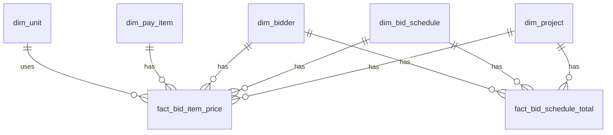

# Data Model Overview

This project is sheet-native: it parses Bid Tabulation Excel sheets into a clean analytical extract for historical analysis. It does not establish authoritative selection outcomes.

## Primary Deliverable
- `compiled_excel_itemized_clean.csv`: canonical bidder-line extract (Project x Schedule x Line Item x Bidder), including totals rows.

## Analysis Schema (Derived from Bid Tab Sheets)
- `dim_project`: parsed sheet header fields.
- `dim_bid_schedule`: schedule identity inferred from sheet context.
- `dim_bidder`: bidder columns (contractors plus engineer's estimate if present).
- `dim_pay_item`: parsed item codes/sections and cleaned description.
- `dim_unit`: unit codes observed in sheets.
- `fact_bid_item_price`: bidder-level line item values.
- `fact_bid_schedule_total`: bidder-level schedule totals rows.

## Optional Tables (Flag-Gated)
- `dim_specification`, `bridge_pay_item_spec` with `--emit_spec_tables`.
- `fact_project_pay_item_metrics` with `--emit_metrics` via `scripts/build_metrics.py`.
- `fact_award` legacy-named placeholder with `--emit_award_table` for externally supplied selection context.

## ERD

